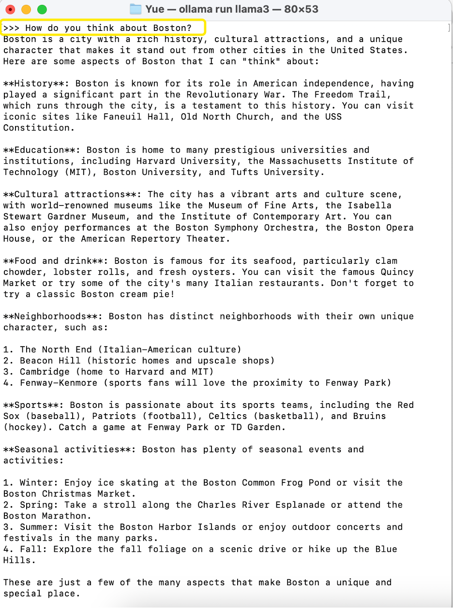
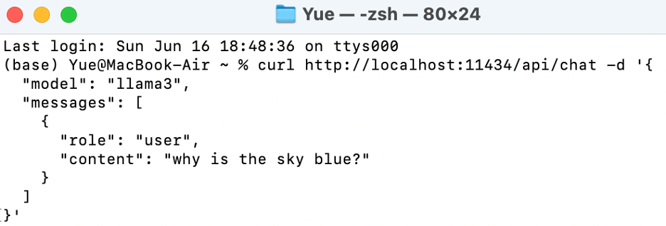
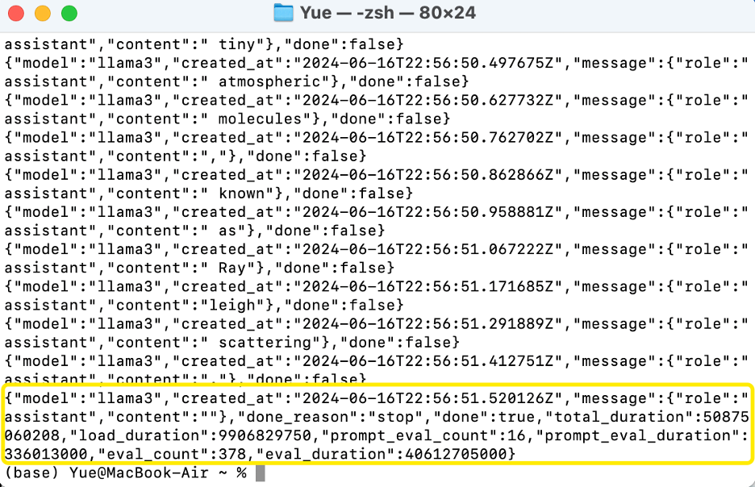
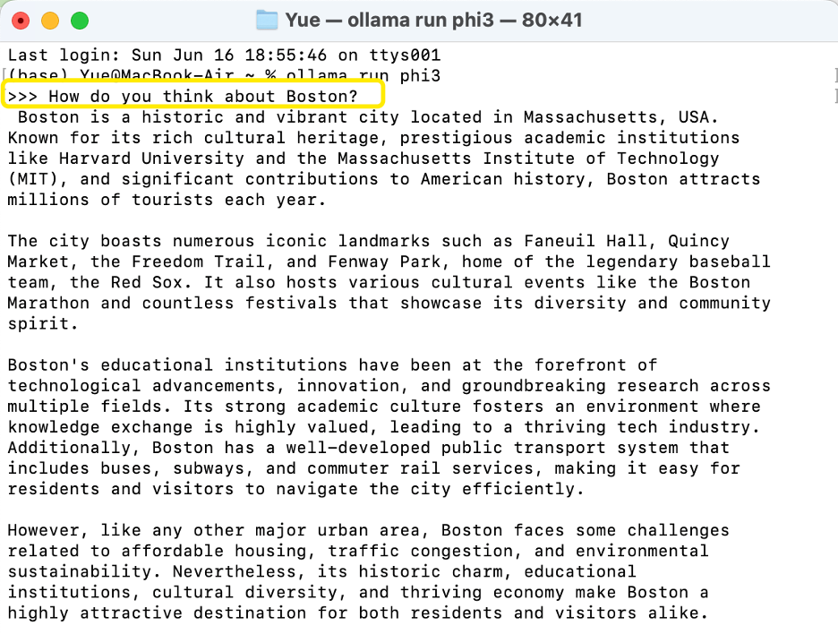
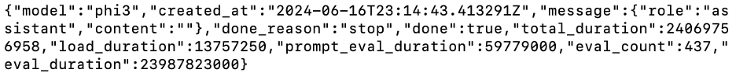
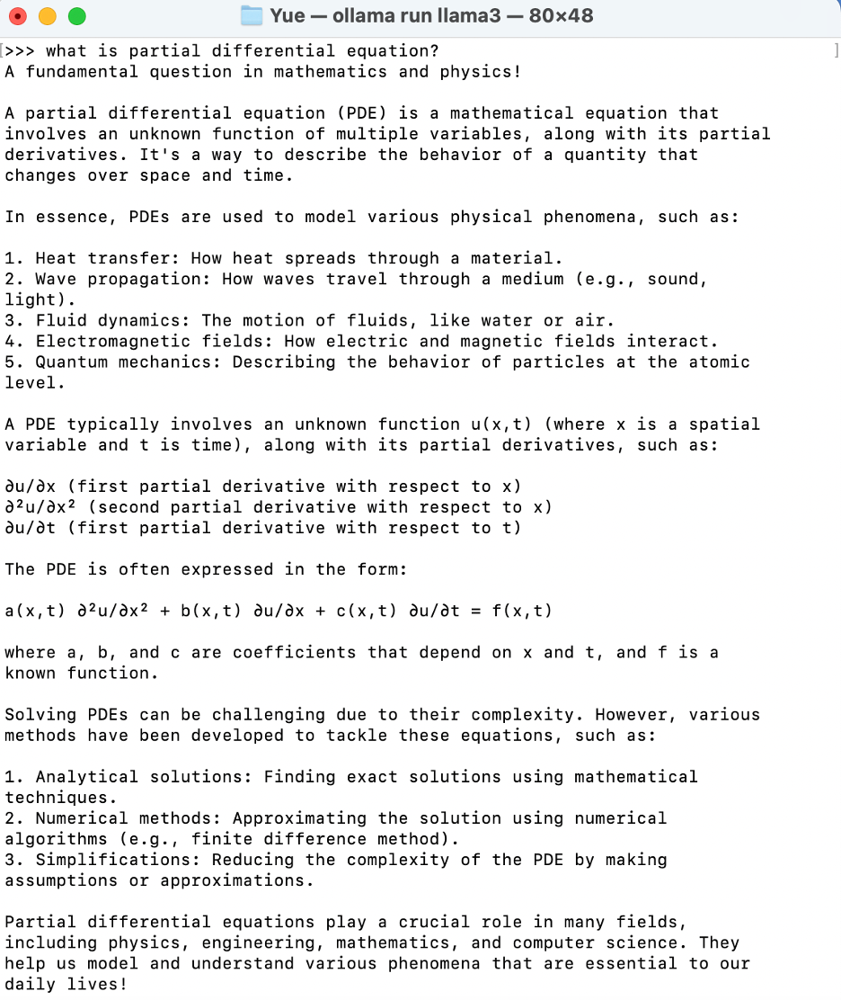
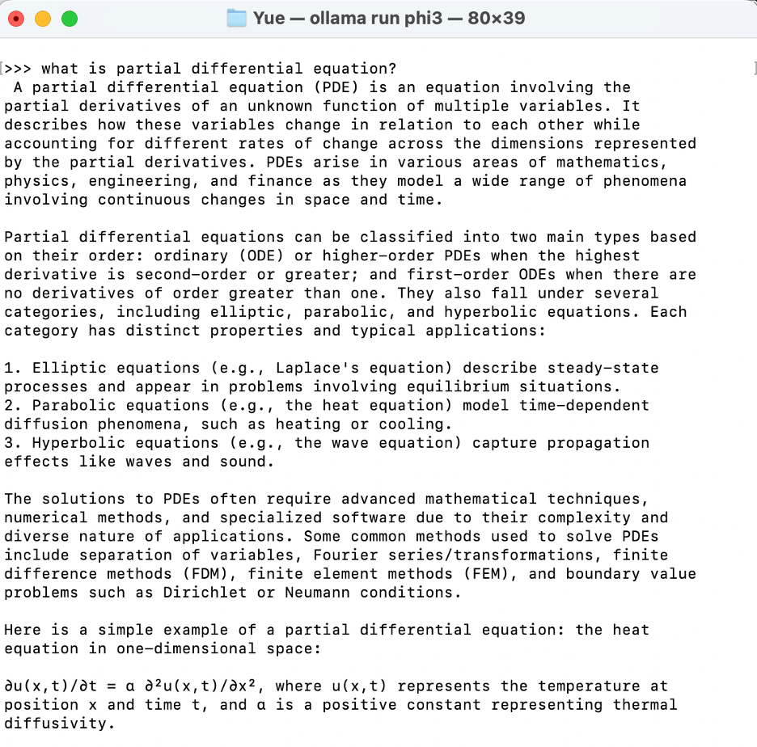

# Local-LLM-Deployment-and-Interaction

## Download Ollama from:

https://www.ollama.com/


## Run and chat with Llama 3:

- Open shell and run the command:

`ollama run llama3`


- Send a message to ask llama3



- Interact with the Llama3 via the curl command

1. Request:

```
curl http://localhost:11434/api/chat -d '{
"model": "llama3",
"messages": [
{
"role": "user",
"content": "why is the sky blue?"
}
]
}'
```



2. Final response:
   

## Run and chat with Phi 3 Mini

- Open shell and run the command:

`ollama run phi3`

- Send a message to ask Phi 3 Mini
  

- Interact with the Phi 3 Mini via the curl command

1. Request:

```
curl http://localhost:11434/api/chat -d '{
"model": "phi3",
"messages": [
{ "role": "user", "content": "why is the sky blue?" }
]
}'
```

2. Final response:
   

## Comparison of the two models

- Prompt:

what is partial differential equation?

- Response by Llama3:
  

- Response by Phi3:



- Analyze

The responses from the Llama3 and Phi3 models provide an informative overview of partial differential equations (PDEs), but they differ in style and depth of detail, reflecting the potential differences in training, intended use, or output design of each model.
Response Characteristics from Llama3:

1. Detailed and Educational: The response is thorough, providing a solid educational overview suitable for learners unfamiliar with the topic. It explains what PDEs are and lists several applications, making the information accessible and practical.
2. Examples and Applications: It goes further to detail specific examples and methods of solving PDEs, enhancing understanding by linking the abstract concept to real-world applications in physics and engineering.
3. Structured Explanation: The response uses a structured format that categorizes information clearly—definition, applications, and solving methods—which can be very effective in educational and explanatory contexts.
4. Mathematical Formulation: It includes a specific example of a PDE formulation, helping to visualize the mathematical aspect of the discussion.
   Response Characteristics from Phi3:
5. Concise and General Overview: The Phi3 response is shorter and more concise, providing a high-level overview without going into as much depth as the Llama3 model.
6. Categorization and Types: This model categorizes PDEs into elliptic, parabolic, and hyperbolic, offering a glimpse into the different types of equations and their applications, which is beneficial for understanding the broader scope of PDEs.
7. Focus on Mathematical Classification: It emphasizes the classification of PDEs more than specific applications, which might appeal more to someone with a background in mathematics or someone seeking a concise summary rather than detailed applications.
8. Technical Terminology and Methods: It briefly mentions the methods used to solve PDEs and discusses boundary value problems, appealing to an audience perhaps more versed in the technical or theoretical aspects of mathematics.
   Analysis of Differences:
   • Depth vs. Brevity: Llama3's response is more detailed, making it suitable for educational purposes or readers who need a comprehensive understanding. In contrast, Phi3 provides a succinct overview that might cater more to readers who already have some background knowledge or need a quick reference.
   • Educational Approach vs. Technical Summary: Llama3 seems to aim at educating the reader with step-by-step explanations and practical applications, whereas Phi3 focuses on a technical summary, which might be preferable for quick look-ups or academic referencing.
   • User-Friendly vs. Technical Language: The language used by Llama3 is more accessible to a general audience, while Phi3 uses language that might be more familiar to someone with a background in science or engineering.
